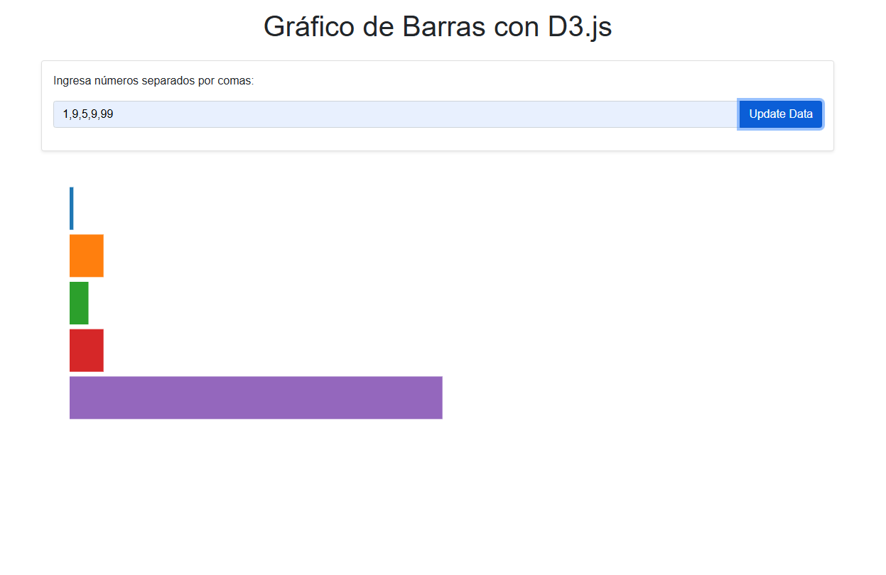

# Gráfico de Barras con D3.js

Esta es una aplicación web que permite generar un gráfico de barras horizontal utilizando la librería **D3.js**. Los datos se ingresan en un campo de texto como números separados por comas, y el gráfico se actualiza automáticamente al hacer clic en el botón "Update Data".

## Características principales
- **Entrada de datos**: Permite ingresar números separados por comas (ejemplo: `4,8,15,16`).
- **Gráfico de barras horizontal**: Muestra los datos en un gráfico de barras orientado horizontalmente.
- **Colores únicos**: Cada barra tiene un color diferente, y no hay dos barras adyacentes con el mismo color.
- **Diseño responsive**: La interfaz se adapta a diferentes tamaños de pantalla gracias a Bootstrap.

## Requisitos
- Un navegador web moderno (Chrome, Firefox, Edge, etc.).
- Conexión a Internet (para cargar D3.js y Bootstrap desde CDN). Se usa un CDN, para no descargar librerias.

## Cómo visualizar la aplicación en local

### Pasos para ejecutar la aplicación:
1. **Clona o descarga el repositorio**:
   - Si tienes Git instalado, puedes clonar el repositorio con el siguiente comando:
     ```bash
     git clone https://github.com/Ewin24/GraficoBarrasD3.git
     ```
   - Si no usas Git, descarga el código como archivo ZIP y descomprímelo.

2. **Abre el proyecto**:
   - Navega hasta la carpeta del proyecto:
     ```bash
     cd GraficoBarrasD3
     ```

3. **Ejecuta la aplicación**:
   - Abre el archivo `index.html` en tu navegador. Puedes hacerlo de dos maneras:
     - Arrastra el archivo `index.html` a una ventana del navegador.
     - O usa un servidor local (recomendado). puedes hacer uso de extension como liveServer.


4. **Usa la aplicación**:
   - Ingresa números separados por comas en el campo de texto (ejemplo: `4,8,15,16`).
   - Haz clic en el botón "Update Data" para generar el gráfico de barras.

---

## Estructura del proyecto
- **`index.html`**: Contiene la estructura HTML de la aplicación y los enlaces a Bootstrap y D3.js.
- **`app.js`**: Contiene el código JavaScript para generar el gráfico de barras con D3.js.
- **`README.md`**: Este archivo, con instrucciones para ejecutar la aplicación.

---

## Tecnologías utilizadas
- **HTML5**: Para la estructura de la página.
- **Bootstrap 5**: Para el diseño y la estilización de la interfaz.
- **D3.js**: Para la generación del gráfico de barras.
- **JavaScript**: Para la lógica de la aplicación.

---

## Captura de pantalla

